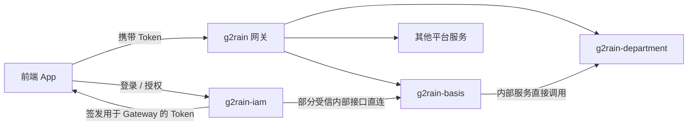

<p align="center">
  
</p>

# g2rain-basis

[](LICENSE)
[](https://openjdk.org/)
[](https://spring.io/projects/spring-boot)
[](https://spring.io/projects/spring-cloud)
[](https://maven.apache.org/)

g2rain 平台核心主数据与权限治理服务，统一维护组织、用户、通行证、应用、资源、角色、功能权限以及外部身份提供方关系，为 IAM、网关、管理端和其他平台服务提供稳定的领域契约与运行时能力。

[官网](https://www.g2rain.com) · [完整文档](docs/index.md) · [中央架构 Profile](https://github.com/g2rain/g2rain/tree/architecture-v1.0.0/docs/architecture/profiles/java-domain-service) · [架构说明](docs/architecture/overview.md) · [代码规范](docs/development/code-conventions.md) · [Issues](https://github.com/g2rain/g2rain/issues) · [Discussions](https://github.com/g2rain/g2rain/discussions)

## 项目定位

`g2rain-basis` 位于平台基础服务层，是组织、身份主数据、应用资源和功能权限关系的权威数据服务：

- 向 `g2rain-iam` 提供 Passport、用户、IdP 绑定和企业应用授权等受信内部能力。
- 向 Gateway 后面的 App 和平台调用方提供组织、应用、资源、角色与权限接口。
- 直接调用 `g2rain-department` 的内部服务契约，协同处理部门主体相关能力。
- 使用 MySQL 持久化主数据，通过 Redis、Nacos 和 Kafka 接入平台基础设施。

## 核心领域

| 领域 | 代表对象 | 主要职责 |
| --- | --- | --- |
| 组织与租户 | `Organ`、`OrganClosure`、`TenantProvision` | 维护组织层级、组织范围和租户开通。 |
| 身份主数据 | `User`、`Passport`、`LoginToken` | 维护用户、通行证与登录令牌记录。 |
| 应用治理 | `Application`、`ApplicationSuite`、`ApplicationAuthorization` | 管理应用定义、归类和机构授权。 |
| 资源模型 | `ResourceMenu`、`ResourcePage`、`ResourcePageElement`、`ResourceApi` | 维护可授权的菜单、页面、页面元素和 API。 |
| 权限治理 | `Role`、`ControlDomain`、`ControlUnit` | 组合角色、能力与资源关系，聚合主体权限。 |
| 身份提供方 | `PassportIdpBinding`、`IdpEnterpriseOrgan`、`IdpEnterpriseApplicationAuthorization` | 管理外部主体绑定、企业映射和企业应用授权。 |
| 平台治理 | `AuditEvent`、`ServiceRegistry`、`PersonalStaticAccessToken` | 支撑审计、服务登记和静态访问令牌。 |

## 认证与服务访问



- App 从 IAM 获得 Token，再携带 Token 通过 Gateway 访问平台服务。
- IAM 是受信服务例外，只能直连 Basis 明确开放的部分内部接口。
- Basis 与 Department 按内部服务契约直接调用，不经过 Gateway。
- 完整时序及安全边界见[核心运行流程](docs/architecture/runtime-flows.md)。

## 架构概览

```text
g2rain-basis-api
  领域契约、DTO、VO、枚举
          ↑
g2rain-basis-biz
  Controller、Service、DAO、领域实现
          ↑
g2rain-basis-startup
  Spring Boot 启动、运行配置、镜像构建
```

依赖只能沿 `startup → biz → api` 方向流动。API 模块不得依赖业务实现或启动模块，业务模块不得反向依赖启动模块。详细约束见[模块与依赖边界](docs/architecture/dependencies.md)。

| 模块 | 职责 |
| --- | --- |
| `g2rain-basis-api` | 对外提供组织、用户、应用、资源、权限和 IdP 等领域契约。 |
| `g2rain-basis-biz` | 实现领域规则、接口适配、数据访问、缓存同步和服务协作。 |
| `g2rain-basis-startup` | 组装可运行 Spring Boot 服务并提供运行、观测和镜像配置。 |

## 技术栈

| 类别 | 技术 |
| --- | --- |
| 运行时 | Java 25、Spring Boot 4.0.5、Spring Cloud 2025.1.1 |
| 数据访问 | MyBatis、MySQL、MapStruct |
| 平台基础设施 | Redis、Nacos、Kafka、OpenFeign |
| API 与文档 | Spring Web、Jakarta Validation、OpenAPI |
| 构建与部署 | Maven、Jib、Docker |
| 测试 | JUnit 5、Mockito |

## 快速开始

### 环境

- JDK 25
- Maven 3.9+
- MySQL 8+
- Redis
- Nacos
- Kafka（启用审计事件消费时需要）

### 构建与测试

```bash
mvn clean verify
```

### 启动服务

```bash
mvn -pl g2rain-basis-startup -am spring-boot:run
```

默认端口为 `8080`，默认 profile 为 `dev`。生产或共享环境应通过环境变量及 Nacos 配置覆盖本地默认值，参见[配置说明](docs/operations/configuration.md)。

健康检查入口：

```text
GET /actuator/health
```

## CRUD 代码生成

项目通过 `g2rain-crafter` 根据数据库表生成标准 CRUD 骨架：

```bash
mvn g2rain-crafter:bootstrap
```

生成前应在 `codegen.properties` 中收敛 `database.tables`，并保持 `tables.overwrite=false`。生成结果必须经过 Git Diff 审查，再补充领域状态机、幂等、事务、权限、凭证脱敏和测试。详见[CRUD 代码生成](docs/development/code-generation.md)。

## 项目文档

| 场景 | 入口 |
| --- | --- |
| 文档首页 | [docs/index.md](docs/index.md) |
| 架构总览 | [docs/architecture/overview.md](docs/architecture/overview.md) |
| 中央基线与项目差异 | [Java Domain Service 1.0.0](https://github.com/g2rain/g2rain/tree/architecture-v1.0.0/docs/architecture/profiles/java-domain-service) · [接入项](docs/architecture/deviations.md) |
| 本地开发与测试 | [docs/development/local-development.md](docs/development/local-development.md) |
| 代码规范 | [docs/development/code-conventions.md](docs/development/code-conventions.md) |
| API 与数据库 | [API 设计规范](docs/development/api-conventions.md) · [数据库与数据模型](docs/development/database-conventions.md) |
| 测试与完成定义 | [测试策略](docs/development/testing.md) · [Definition of Done](docs/development/definition-of-done.md) |
| 需求设计 | [docs/requirements/README.md](docs/requirements/README.md) |
| CRUD 代码生成 | [docs/development/code-generation.md](docs/development/code-generation.md) |
| 模块职责 | [docs/architecture/modules.md](docs/architecture/modules.md) |
| 核心运行流程 | [docs/architecture/runtime-flows.md](docs/architecture/runtime-flows.md) |
| 配置与敏感信息 | [docs/operations/configuration.md](docs/operations/configuration.md) |
| 安全与可观测性 | [安全边界](docs/security/security-boundaries.md) · [可观测性](docs/operations/observability.md) |
| 镜像与部署 | [docs/operations/deployment.md](docs/operations/deployment.md) |
| 故障排查 | [docs/operations/troubleshooting.md](docs/operations/troubleshooting.md) |
| 企业微信授权设计 | [docs/design/wechat-work-authorization.md](docs/design/wechat-work-authorization.md) |
| 社区与贡献 | [docs/community.md](docs/community.md) |

## 开发约定

- 依赖方向固定为 `g2rain-basis-startup → g2rain-basis-biz → g2rain-basis-api`。
- Controller 负责协议适配，业务规则、事务、幂等和安全校验位于 Service。
- DTO、VO、PO 不混用，常规转换使用 MapStruct，敏感字段在 Service 出口显式处理。
- 内部接口使用明确的 `/internal/...` 路径并设置 `@Operation(hidden = true)`，但路径和文档隐藏不能替代访问控制。
- 新增或修改代码遵循[代码规范](docs/development/code-conventions.md)，提交前运行 `mvn clean verify`。

## 职责边界

本仓库负责平台主数据、资源模型、权限关系和 IdP 绑定/授权数据，不负责：

- OAuth/OIDC 登录页面、授权码与令牌签发，这些由 `g2rain-iam` 负责。
- 统一流量入口、网关鉴权和下游转发，这些由网关服务负责。
- 部门数据权限领域，该能力由 `g2rain-department` 负责。
- 管理端交互界面，该能力由 `g2rain-manager-app` 负责。

## 贡献

欢迎通过 Issue、Discussion 和 Pull Request 参与 g2rain 建设。

代码贡献前请尽量补充必要的测试和文档，并确保构建、测试与静态检查通过。提交代码时，请同步更新受影响的 `docs` 文档；新增或改变长期架构决策时，在 `docs/decisions` 中增加 ADR。

提交前至少执行：

```bash
mvn clean verify
```

## 许可证

本项目基于 [Apache 2.0 许可证](LICENSE) 开源。

## 联系我们

- 官网：[https://www.g2rain.com](https://www.g2rain.com)
- Issues：[GitHub Issues](https://github.com/g2rain/g2rain/issues)
- 讨论：[GitHub Discussions](https://github.com/g2rain/g2rain/discussions)
- 邮箱：[g2rain_developer@163.com](mailto:g2rain_developer@163.com)

## 致谢

感谢所有为 g2rain 项目提交 Issue、代码、文档、建议和使用反馈的开发者们！
