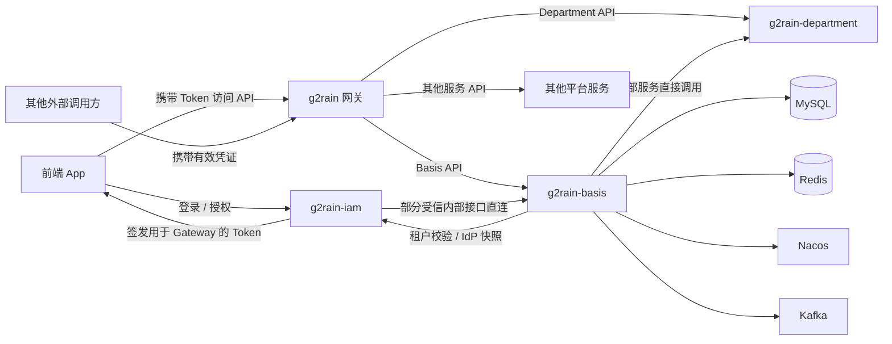

# 架构总览

本项目按 g2rain [`java-domain-service 1.0.0`](https://github.com/g2rain/g2rain/tree/architecture-v1.0.0/docs/architecture/profiles/java-domain-service) 进行接入准备。本页描述 Basis 的领域落地；尚未完成的接入项见[架构差异](deviations.md)。

## 系统职责

`g2rain-basis` 位于 g2rain 平台基础服务层，是组织、身份主数据、应用资源和功能权限关系的权威数据服务。

它解决四类问题：

1. 组织、用户、通行证和租户如何被统一建模与维护。
2. 应用、菜单、页面、页面元素和 API 如何形成平台资源模型。
3. 角色、控制域、控制单元与资源如何组合为主体权限。
4. 外部身份提供方中的企业和用户如何映射到 g2rain 主数据。

## 系统上下文



- 前端 App 直接与 `g2rain-iam` 完成登录或授权，并取得用于通过 Gateway 访问平台 API 的 Token。
- App 携带该 Token 通过网关访问 Basis、Department 及其他平台服务；其他外部调用方同样需要携带有效凭证。
- 网关负责向 App 暴露服务接口，并把请求路由到对应的后端服务。
- `g2rain-iam` 是受信服务例外，可以直接调用 Basis 明确开放的部分内部接口，不需要经过网关；该例外不代表 IAM 可以绕过边界访问全部管理接口。
- Basis 也通过受信 Feign 契约调用 IAM 的租户校验和 IdP 快照能力；服务间写入与部分成功风险记录在架构差异中。
- Basis 复用 `g2rain-department-api` 契约直接调用 Department；该内部服务调用不经过网关。
- MySQL、Redis、Nacos 和 Kafka 属于 Basis 直接使用的基础设施依赖。

## 容器与模块

```text
g2rain-basis-startup
        │ depends on
        ▼
g2rain-basis-biz
        │ depends on
        ▼
g2rain-basis-api
```

API 模块是可供其他服务复用的契约层；Biz 模块实现领域规则、Web 适配和持久化；Startup 模块负责运行时组装，不承载领域规则。

具体包职责见[模块职责](modules.md)，允许的依赖方向见[依赖边界](dependencies.md)。

## 核心领域

| 领域 | 代表对象 | 主要职责 |
| --- | --- | --- |
| 组织与租户 | `Organ`、`OrganClosure`、`TenantProvision` | 维护组织层级、租户开通和组织范围。 |
| 身份主数据 | `User`、`Passport`、`LoginToken` | 维护用户、登录凭证主体和令牌记录。 |
| 应用治理 | `Application`、`ApplicationSuite`、`ApplicationAuthorization` | 管理应用定义、归类和机构授权。 |
| 资源模型 | `ResourceMenu`、`ResourcePage`、`ResourcePageElement`、`ResourceApi` | 维护平台可授权资源。 |
| 权限治理 | `Role`、`ControlDomain`、`ControlUnit` | 组合角色、能力和资源关系并聚合主体权限。 |
| 身份提供方 | `PassportIdpBinding`、`IdpEnterpriseOrgan`、`IdpEnterpriseApplicationAuthorization` | 管理外部主体绑定、企业映射和企业应用授权。 |
| 平台治理 | `AuditEvent`、`ServiceRegistry`、`PersonalStaticAccessToken` | 支撑审计、服务登记和静态访问令牌。 |

## 非职责

- 不签发 OAuth/OIDC 授权码和访问令牌。
- 不实现统一网关和请求转发。
- 不承载部门数据权限领域模型。
- 不实现管理端页面。
- 不在本服务中保存 IAM 临时 OAuth State、Suite Ticket 或短期 IdP Token。
