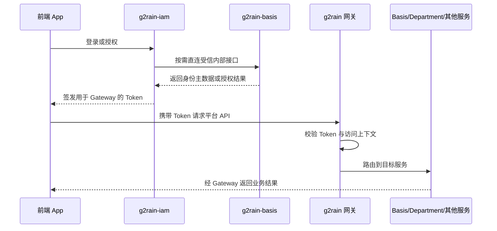
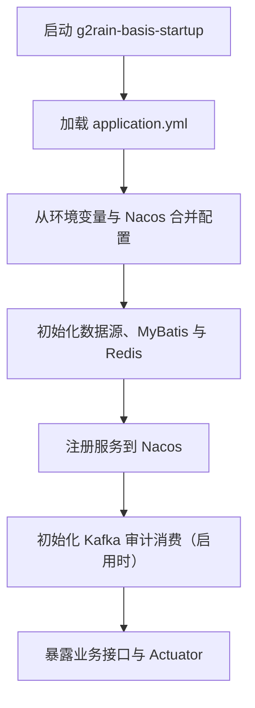
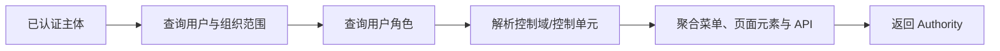

# 核心运行流程

## App 认证与平台访问



认证链路由 IAM 负责，业务访问链路由 Gateway 统一承接。App 不使用 IAM 与 Basis 的内部直连通道。

## 服务启动



## 主体权限聚合



权限聚合依赖用户、角色、控制域、控制单元和资源关系。接口层不得绕过 Service 直接拼装权限结果。

## 租户开通

```text
接收租户开通请求
→ 校验组织与账号输入
→ 创建或复用组织主数据
→ 创建用户与 Passport
→ 建立用户、组织、角色关系
→ 返回开通结果
```

租户开通是跨多个聚合的事务性流程，应保持幂等，并通过测试覆盖重复请求和部分失败。

## IdP Passport 解析与绑定

```text
IAM 通过受信内部接口直接提交 IdP 主体
→ Basis 按 IdP 类型、主体和企业范围查找绑定
→ 找到绑定：返回 Passport
→ 未找到且允许自动开户：创建或解析 Passport
→ 保存 PassportIdpBinding
→ IAM 继续创建会话与令牌流程
```

Basis 只负责主数据解析和绑定；IAM 通过明确开放的部分内部接口与 Basis 直接交互，负责 OAuth State、外部票据、会话、授权码和令牌签发。该直连边界不适用于前端 App 或普通外部调用方。

## 企业级 IdP 应用授权

详细设计见[企业微信三方应用授权与扫码登录](../design/wechat-work-authorization.md)。关键规则：

- 企业授权记录按身份源、IdP 应用和外部企业幂等维护。
- 取消授权更新状态并清除凭证密文，不物理删除审计信息。
- 管理端列表、分页和登录解析不得返回可用凭证。
- 企业微信通讯录同步尚未因此自动获得支持。

## 受信服务协作

IAM、Gateway、Basis 与 Department 的受信接口清单、同步写入边界、租户 IdP 同步的部分成功事实及目标补偿规则，见[受信服务 API 与跨服务协作](../design/trusted-service-collaboration.md)。
