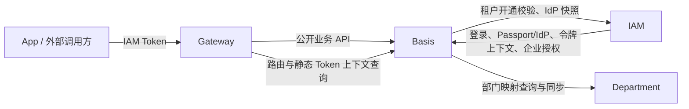
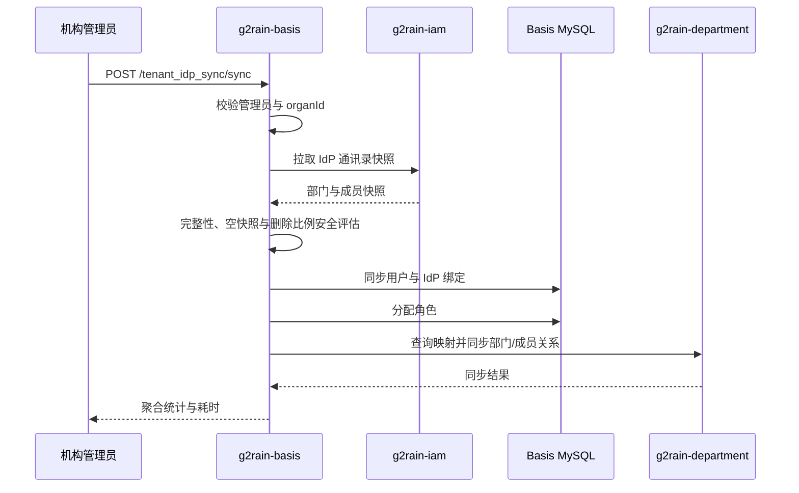

# 受信服务 API 与跨服务协作

本文记录 `g2rain-basis` 当前与 IAM、Gateway、Department 之间的受信调用事实，以及同步写入必须满足的目标约束。路径隐藏和服务发现只描述接口可见性，不代表服务身份或授权已经验证。

## 调用关系

## 当前受信契约清单

| 方向 | 代表路径或契约 | 类型 | 当前用途 | 仍需证明的边界 |
| --- | --- | --- | --- | --- |
| IAM → Basis | `/internal_auth/internal_login` | 写/认证 | 校验账号密码并返回 Passport 信息 | IAM 服务身份、限流、失败审计和敏感输入日志保护 |
| IAM → Basis | `/internal/idp_passport/resolve` | 跨机构查询 | 按 IdP 主体解析 Passport、绑定和机构用户 | 调用方身份、最小返回字段和枚举防护 |
| IAM → Basis | `/internal/passport_idp_binding/bind` | 幂等写 | 保存扫码绑定关系 | State 校验事实的传递、防重放和并发唯一键 |
| IAM → Basis | `/internal/idp/enterprise-application-authorization/*` | 查询/写 | 企业应用授权写入、撤销和解析 | 服务身份、密文访问权限、重试和审计 |
| IAM/Gateway → Basis | `/login_token/...` 隐藏接口 | 查询/写 | 登录令牌保存、JWT 上下文和静态 API Key 解析 | 每个接口的唯一调用方、原始 API Key 传输保护和限流 |
| Basis → IAM | `TenantProvisionClient.verifyCreateOrgan` | 查询/校验 | 创建机构前校验 Passport 是否允许开户 | 超时策略、调用身份和 IAM 不可用时的明确结果 |
| Basis → IAM | `IdpSyncClient` | 外部快照查询 | 拉取钉钉部门和成员快照 | 超时、分页完整性、快照标识和可安全重试语义 |
| Basis → Department | `DepartmentIdpSyncApi.listMappedIdpDeptIds` | 查询 | 同步前评估已有部门映射规模 | 调用身份、机构范围与超时 |
| Basis → Department | `DepartmentIdpSyncApi.sync` | 写 | 同步部门、映射和成员关系 | 幂等键、重复调用结果、部分成功补偿和版本兼容 |

表中“仍需证明”表示当前源码和测试不足以确认完整保障，不表示保护一定不存在于网关、Starter 或部署网络中。正式采用基线前，应由对应责任仓库提供配置、实现或集成测试证据。

## 租户 IdP 同步现状

当前外层 `TenantIdpSyncServiceImpl.sync` 没有跨服务事务。成员/绑定和角色写入发生在 Department 同步之前；如果 Department 调用超时或失败，Basis 已完成的本地提交不会自动回滚。因此当前结果是“顺序编排、允许部分成功”，不能描述为全局原子事务。

## 目标规则

### 服务身份与授权

- 每个受信入口登记唯一调用方或调用方集合，拒绝未登记服务。
- 可信主体、服务身份和 `organId` 必须能被验证，不能只取普通请求字段。
- `WithoutIsolation` 只在已登记流程中使用，Service 显式限定 Passport、企业、应用和机构范围。
- OpenAPI 隐藏、路径前缀和内网策略作为纵深防御，不作为唯一控制。

### 幂等、重试与兼容

- 写命令使用稳定业务幂等键；不能以一次 HTTP 请求成功作为唯一完成依据。
- 调用方只在契约声明可安全重试时自动重试；超时后的未知结果必须可查询或对账。
- API DTO 采用向后兼容演进，破坏性变更先升级提供方，再升级调用方，并记录回滚组合。
- IdP 快照应能够识别来源、范围、完整性和同步模式，禁止把不完整快照当成全量事实。

### 部分成功与恢复

- 同步结果应能区分 IAM 拉取失败、Basis 主数据失败、角色分配失败和 Department 失败。
- Department 失败后，运维方需要能够使用同一业务键安全重试，或执行明确的对账/补偿流程。
- 在可靠补偿验证完成前，不对外承诺跨 Basis、IAM、Department 的原子性。
- 日志和指标记录阶段、耗时、数量与错误码，不记录完整人员快照、密码、Token 或 IdP 凭证。

## 变更检查

新增或修改受信契约时，同一需求至少更新：

1. 调用方、路径和数据最小集。
2. 服务身份、租户与权限验证方式。
3. 幂等键、重试、超时和未知结果处理。
4. 本地事务边界、跨服务部分成功与补偿。
5. 兼容发布顺序、回滚和可观测性。
6. 单元、契约和集成测试证据。

未满足的内容继续登记在[架构差异](../architecture/deviations.md)，不得因文档已建立而视为实现完成。
